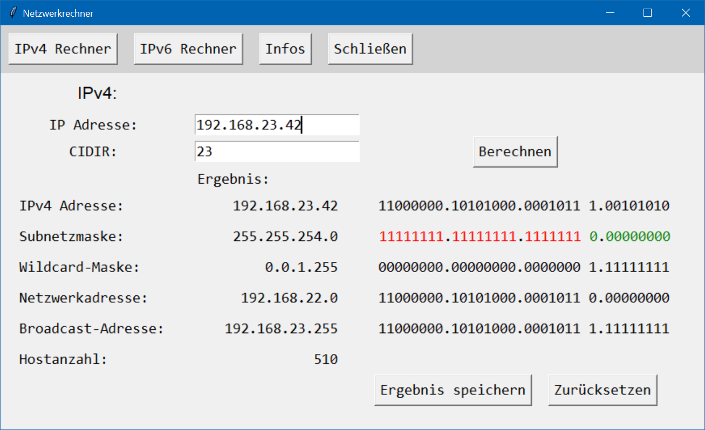
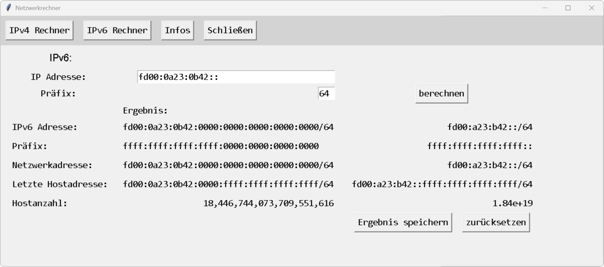
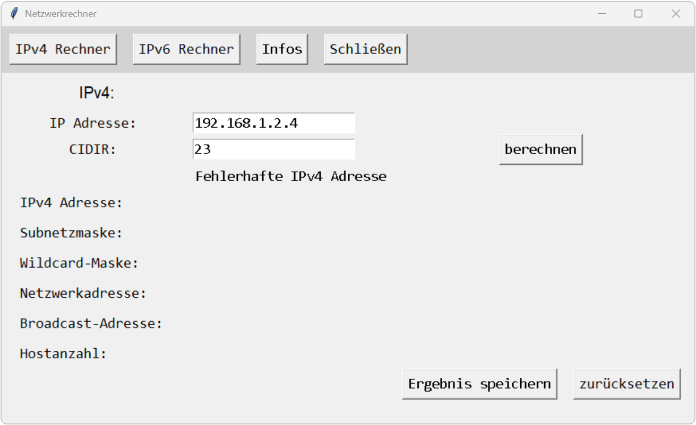

# Projekt: Netzwerkrechner
Desktop Programm zur Berechnung der Netzwerkadresse, Broadcast-Adresse und Host-Anzahl bei IPv4 durch Angabe der IP-Adresse und CIDR.
Zusätzlich kann man für IPv6 die Netzwerkadresse, höchste Adresse und Host-Anzahl durch Angabe der IP-Adresse und Präfix berechnen. Außerdem können die Ergebnisse in eine Text Datei gespeichert werden. Erstellt wurde es mit Python und Tkinter. Das ganze wurde ohne den Import eines Netzwerkberechnungsmodul realisiert.
<div style="text-align: center;">

</div>


## Ziel des Projekts:
Umsetzung der IP Berechnung als Algorithmus in einen Programm. Die erste Idee dazu diesen Projekt entstand während des Lernfeldes 4 und wurde ansatzweise in C# umgesetzt. Im darauffolgenden Lernfeld 5, in dem es eine Einführung in Python gab. Wurde die Idee zum Netzwerkrechner genutzt, um mit einen interessanten Projekt mit der Sprache Python vertraut zu machen.  
## Verwendete Technologien
- **Python 3.13.1**
- **Tkinter** für die Benutzeroberfläche
- **save_output** zur Speicherung der Ergbenisse als Textdatei
## Funktionen
- Grafische Benutzeroberfläche für die Ein- und Ausgabe
- Eingabe der IPv4 Adresse und CIDER oder IPv6 Adresse und Präfix
- Berechnungen:
  - IPv4:
    - Subnetzmaske
    - Wildcard-Maske
    - Netzwerkadresse
    - Broadcast-Adresse
    - Host-Anzahl
  - IPv6:
    - Netzwerkadresse
    - höchste IP-Adresse
    - Host-Anzahl
- Darstellung der Ausgabe von:
  - IPv4 als Dezimal und Binärzahlen
  - IPv6 als Hexzahlen in Lang- und Kurform
- Optionale Speicherung der Ergebnisse als Textdatei
### UML Sequenzdiagramm
```Mermaid
   sequenceDiagram
    participant User as Benutzer
    participant Main as Main
    participant IPv4Page as IPv4Page
    participant SaveOutputWindow as SaveOutputWindow

    User ->> Main: start programm
    
    Main ->> Main: mainloop()
    activate Main
    Main ->> IPv4Page: show Frame
    activate IPv4Page
    User ->> IPv4Page: input IPv4 adress
    User ->> IPv4Page: input CIDIR notation
    User ->> IPv4Page: press berechnen
    
    IPv4Page ->> IPv4Page: ipv4_cal() 
    activate IPv4Page
    IPv4Page ->> IPv4Page: in_one_decimal_string()
    IPv4Page ->> IPv4Page: in_one_binary_string()
    IPv4Page -->> User: show Results
    deactivate IPv4Page

    User ->> IPv4Page: Ergebnis speichern
    IPv4Page ->> IPv4Page: open_save_window()
    IPv4Page ->> SaveOutputWindow: show Window
    activate SaveOutputWindow
    User ->> SaveOutputWindow: Input filename
    User ->> SaveOutputWindow: Press speichern
    SaveOutputWindow ->> SaveOutputWindow: save_output()
    SaveOutputWindow -->> User: close
    deactivate SaveOutputWindow
    
    User ->> Main: press Schließen button
    Main ->> Main: destroy()
    IPv4Page -->> Main : close
    deactivate IPv4Page
    Main -->> User: programm close
    deactivate Main
```

### Screenshots
<div style="text-align: center;">



</div>
