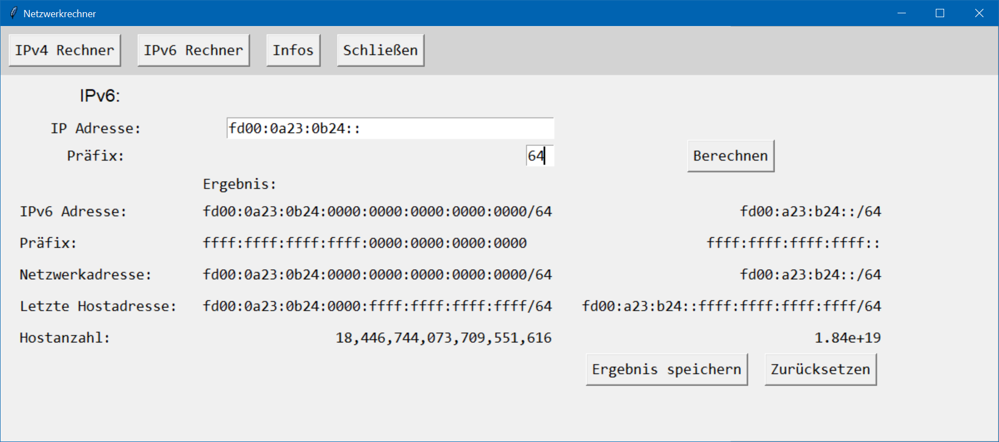
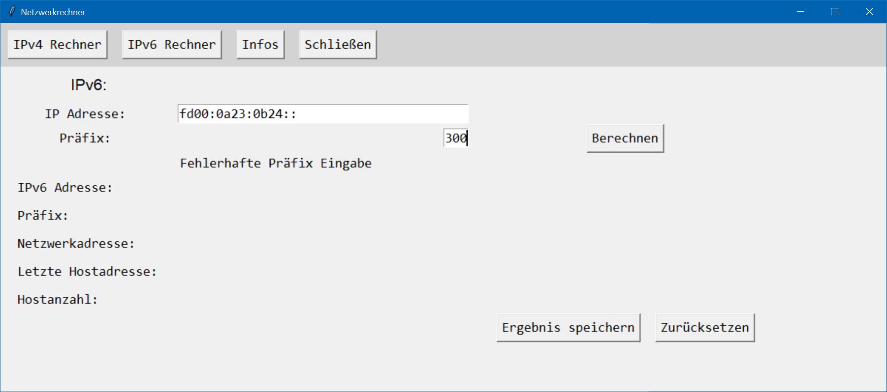

# Projekt: Netzwerkrechner
**Desktop-Anwendung zur Berechnung von IPv4- und IPv6-Netzwerkdaten.** Mit diesem Programm lassen sich unter Angabe einer IP-Adresse und einer CIDR-Notation (bei IPv4) bzw. eines Präfixes (bei IPv6) wichtige Netzwerkinformationen berechnen, darunter:
- Netzwerkadresse
- Hostanzahl
- Broadcast-Adresse (nur IPv4)
- Höchste IP-Adresse im Bereich (nur IPv6)

Die Ergebnisse können optional in einer Textdatei gespeichert werden. Die Anwendung wurde mit **Python** und **Tkinter** entwickelt und **verzichtet bewusst auf externe Netzwerkberechnungs-Bibliotheken - alle Algorithmen wurden selbst implementiert.**

<div style="text-align: center;">
<b>Netzwerkrechner: Ausgabe einer IPv4 Berechnung</b> <br>

</div>

## Inhaltsverzeichnis
- [Projektvorstellung](#projektvorstellung)
- [Verwendete Technologien](#verwendete-technologien)
- [Funktionen](#funktionen)
- [UML-Sequenzdiagramm](#uml-sequenzdiagramm)
- [Screenshots](#screenshots)
- [Installation](#installation)
- [Projektverzeichnis](#projektverzeichnis)
- [Hinweise für die Nutzer und Leser](#hinweise-für-alle-nutzer-und-leser)
- [Lizenz](#lizenz)

## Projektvorstellung

Die Idee zu diesem Projekt entstand während des Lernfelds 4, zunächst mit einer einfachen Umsetzung in C#. In Lernfeld 5 wurde es im Rahmen einer Einführung in Python weiterentwickelt.  
Ziel war es, ein funktionales und lehrreiches Projekt umzusetzen, das grundlegende Netzwerkberechnungen durchführt – **ohne** den Einsatz **externer Bibliotheken**. Stattdessen wurden **alle Berechnungen durch eigene Algorithmen** realisiert. Dabei konnten Kenntnisse in Klassen, Funktionen und GUI-Elementen in Python vertieft werden. Gleichzeitig wurde das Verständnis für die Berechnung von Netzwerkadressen gefestigt – mit einem praktischen Tool als Ergebnis.   
Das Programm besteht aus:
- **einer Hauptklasse zur Steuerung der Anwendung**
- **je einer Klasse für die Berechnung und Anzeige der IP-Adressen**
- **einer Klasse zur Speicherung der Ergebnisse als Textdatei**
- **einer Klasse für Hintergrundinformationen**

Die grafische Oberfläche wurde mit **Tkinter** entwickelt – das in Python integrierten Toolkit, das sich besonders durch seine Einsteigerfreundlichkeit auszeichnet. Eine **integrierte Fehlerbehandlung** sorgt dafür, dass ungültige Eingaben abgefangen und **benutzerfreundliche Rückmeldungen** zurückgegeben werden.  
Neben den eigenen Algorithmen für die Berechnung ist eine weitere Besonderheit des Programms die Ausgabe der Ergebnisse: Bei IPv4 zusätzlich in **Binärdarstellung**, bei IPv6 in **Kurz- und Langform**.

Für eine einheitliche und gut lesbare Codebasis kam **Flake8** zur Stilprüfung zum Einsatz. Anstelle der üblichen 80 Zeichen pro Zeile wurde die maximale Zeilenlänge projektweit auf 120 Zeichen festgelegt.  
Mithilfe von **Pyinstaller** entstand eine ausführbare `.exe` Datei. Dadurch lässt sich die Anwendung auch ohne installierte Python-Umgebung direkt starten. Die Datei befindet sich im Ordner `release`.

Das Projekt bot mir eine großartige Gelegenheit, meine ersten Schritte in Python an einem praktischen Problem zu erproben. Ich bekam ein besseres Gefühl dafür, wie Klassen aufgebaut sind, wie in Python zwischen Instanzvaiablen und lokale Variablen innerhalb von Methoden. Außerdem wie essenziell ``try-except``-Blöcke sind, um Programm vor Abstürze durch fehlerhafte Nutzereingaben zu schützen.  
Ich habe bereits einige Ideen, wie man das Programm künftig erweitern könnte – vielleicht ergibt sich irgendwann die Gelegenheit für eine Version 2.0. Besonders viel Freude war es auch, eine ausführbare Datei zu erstellen und Sie Mitschüler zur Verfügung zu stellen. Im Zuge dessen habe ich dafür gesorgt, dass nun auch CIDIR-Eingaben mit einem „/“  korrekt erkannt und akzeptiert. Daher steht nun Version 1.0.1 zur Verfügung.


## Verwendete Technologien
- **Python 3.13.1**
- **Tkinter** – GUI-Toolkit für die Benutzeroberfläche
- **Pyinstaller** – erzeugt eine `.exe`-Datei für Windows
- **Flake8** – Tool zu Stilprüfung (PEP8) 
- **Mermaid** – zur Erstellung des UML-Sequenzdiagramms

## Funktionen
- Intuitive grafische Benutzeroberfläche
  - Anpassen der Fenstergröße an IPv4- bzw. IPv6-Modus
- Eingabeunterstützung für:
  - IPv4-Adressen mit CIDR-Notation
  - IPv6-Adressen mit Präfix
- Berechnete Daten:
  - IPv4:
    - Subnetzmaske
    - Wildcard-Maske
    - Netzwerkadresse
    - Broadcast-Adresse
    - Anzahl möglicher Hosts
  - IPv6:
    - Netzwerkadresse
    - Höchste IP-Adresse im Bereich
    - Anzahl möglicher Hosts
- Ausgabeformate:
  - IPv4 als Dezimal und Binärzahlen
  - IPv6 als Hexzahlen (Lang- und Kurform)
- Weitere Funktionen
  - Optionale Speicherung der Ergebnisse als Textdatei
  - Optionales Zurücksetzen der Eingaben und Ergebnisse

### UML-Sequenzdiagramm


## Screenshots
### Ausgabe einer IPv6 Berechnung:
<div style="text-align: center;">
</div>

### Ausgabe einer Fehlermeldung bei falscher Benutzereingabe bei IPv6:
<div style="text-align: center;">
</div>

### Ausgabe einer Fehlermeldung bei falscher Benutzereingabe bei IPv4:
<div style="text-align: center;">
</div>

### Speicherfenster für Berechnung:
<div style="text-align: center;">
</div>

### Beispiel einer gespeicherten Bereichnung (.txt-Datei):
<div style="text-align: center;">
</div>
<br><br>


## Installation
Es gibt zwei Möglichkeiten das Programm zu nutzen:
### 1. Ohne Installation als .exe Datei
- [Netzwerkrechner.exe herunterladen](https://github.com/devZenger/Netzwerkrechner/tree/main/release)
- Netzwerkrechner.exe ausführen


### 2. Mit Pyhton (Quellcode)
Voraussetzung: Python 3.10 oder neuer muss installiert sein.
#### 1. Repository klonen:
 ```bash
git clone https://github.com/devZenger/Netzwerkrechner.git
```
#### 2. In das Verzeichnis wechseln:
 ```bash
cd Netzwerkrechner
```
#### 3. Starten mit:
 ```bash
python Netzwerkrechner.py
```

## Projektverzeichnis
<pre style="font-size:14px; font-family:Consolas;">
Netzwerkrechner\
├── images\
│    └── Screenshoots für README.md
├── release\
│    └── Netzwerkrechner.exe
├── Beispiel.txt
├── information.py
├── ipv4_calculation.py
├── ipv6_calculation.py
├── LICENSE.md
├── netzwerkrechner.py
├── README.md
└── save_output.py
</pre>

## Hinweise für alle Nutzer und Leser
Dieses Projekt ist im Rahmen meines Selbststudiums entstanden. Für mich war es eine gute Gelegenheit, Gelerntes direkt in einem echten Anwendungsfall auszuprobieren und dabei ein Demonstrationsprojekt für meine Fähigkeiten auf Github zu erstellen. Ich freue mich, wenn das Programm hilfreich ist oder Anregungen gibt.

## Lizenz
Dieses Projekt steht unter der **MIT-Lizenz** und darf gerne weiterverwendet oder angepasst werden – natürlich unter Einhaltung der Lizenzbedingungen.  
Es wurde mit viel Lernfreude und Neugier zu Übungs- und Demonstrationszwecken entwickelt.  
Wenn du Feedback, Fragen oder Ideen hast, freue ich mich über eine Nachricht.

### Verwendete Drittanbieter-Technologien
- **Python 3.13.1** – [PSF License](https://docs.python.org/3/license.html)
- **Tkinter** – Teil der Python-Standardbibliothek ([PSF License](https://docs.python.org/3/license.html))
- **PyInstaller** – [GPL v2 License](https://pypi.org/search/?c=License+%3A%3A+OSI+Approved+%3A%3A+GNU+General+Public+License+v2+%28GPLv2%29)
- **Flake8** – [MIT License](https://github.com/PyCQA/flake8/blob/main/LICENSE)
- **Mermaid** – [MIT License](https://github.com/mermaid-js/mermaid/blob/develop/LICENSE)

Bitte beachte die jeweiligen Lizenzbedingungen bei Weiterverwendung. 

