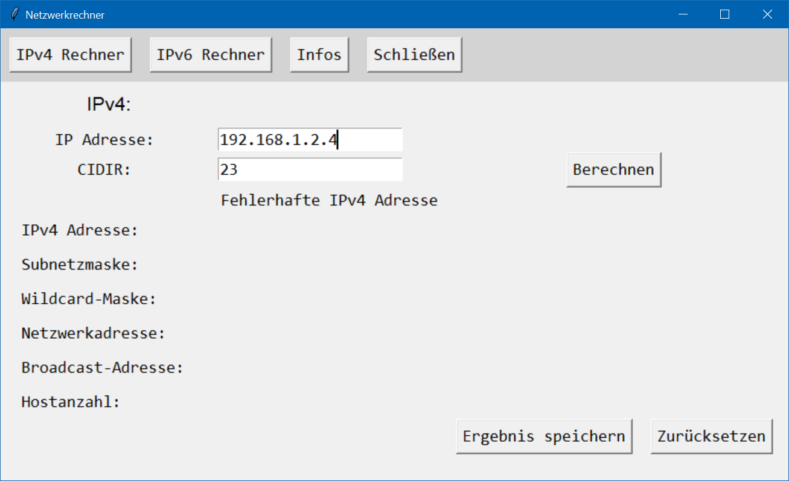

# Projekt: Netzwerkrechner
**Desktop-Anwendung zur Berechnung von IPv4- und IPv6-Netzwerkdaten.** Mit diesem Programm lassen sich unter Angabe einer IP-Adresse und einer CIDR-Notation (bei IPv4) bzw. eines Präfixes (bei IPv6) wichtige Netzwerkinformationen berechnen, darunter:
- Netzwerkadresse
- Hostanzahl
- Broadcast-Adresse (nur IPv4)
- Höchste IP-Adresse im Bereich (nur IPv6)

Die Ergebnisse können optional in einer Textdatei gespeichert werden. Die Anwendung wurde mit **Python** und **Tkinter** entwickelt und **verzichtet bewusst auf externe Netzwerkberechnungs-Bibliotheken - alle Algorithmen wurden selbst implementiert.**

<b>Netzwerkrechner: Ausgabe einer IPv4 Berechnung</b>  

## Inhaltsverzeichnis
- [Projektvorstellung](#projektvorstellung)
- [Verwendete Technologien](#verwendete-technologien)
- [Funktionen](#funktionen)
- [UML-Sequenzdiagramm](#uml-sequenzdiagramm)
- [Screenshots](#screenshots)
- [Installation](#installation)
- [Lizenz](#lizenz)

## Projektvorstellung

Die Idee zu diesem Projekt entstand während des Lernfelds 4, zunächst mit einer einfachen Umsetzung in C#. In Lernfeld 5 wurde es im Rahmen einer Einführung in Python weiterentwickelt.  
Ziel war es, ein funktionales und lehrreiches Projekt umzusetzen, das grundlegende Netzwerkberechnungen durchführt – **ohne** den Einsatz **externer Bibliotheken**. Stattdessen wurden **alle Berechnungen durch eigene Algorithmen** realisiert. Dabei konnten Klassen, Funktionen und GUI-Elemente in Python vertieft werden. Gleichzeitig wurde das Verständnis für die Berechnung von Netzwerkadressen gefestigt - mit einem praktischen Tool als Ergebnis.   
Das Programm besteht aus:
- **einer Hauptklasse zur Steuerung der Anwendung**
- **je einer Klasse für die Berechnung und Anzeige der IP-Adressen**
- **einer Klasse zur Speicherung der Ergebnisse als Textdatei**
- **einer Klasse für Hintergrundinformationen**

Die grafische Oberfläche wurde mit **Tkinter** entwickelt. Eine **integrierte Fehlerbehandlung** sorgt dafür, dass ungültige Eingaben abgefangen und **benutzerfreundliche Rückmeldungen** gegeben werden.  
Neben den eigenen Algorithmen für die Berechnung ist eine weitere Besonderheit des Programms die Ausgabe der Ergebnisse: Bei IPv4 zusätzlich in **Binärdarstellung**, bei IPv6 in **Kurz- und Langform**.

## Verwendete Technologien
- **Python 3.13.1**
- **Tkinter** – GUI-Toolkit für die Benutzeroberfläche
- **Mermaid** – zur Erstellung des UML-Sequenzdiagramm

## Funktionen
- Intuitive grafische Benutzeroberfläche
  - Anpassen der Fenstergröße an IPv4- bzw. IPv6-Modus
- Eingabeunterstützung für:
  - IPv4-Adressen mit CIDR-Notation
  - IPv6-Adressen mit Präfix
- Berechnete Daten:
  - IPv4:
    - Subnetzmaske
    - Wildcard-Maske
    - Netzwerkadresse
    - Broadcast-Adresse
    - Anzahl möglicher Hosts
  - IPv6:
    - Netzwerkadresse
    - Höchste IP-Adresse im Bereich
    - Anzahl möglicher Hosts
- Ausgabeformate:
  - IPv4 als Dezimal und Binärzahlen
  - IPv6 als Hexzahlen (Lang- und Kurform)
- Weitere Funktionen
  - Optionale Speicherung der Ergebnisse als Textdatei
  - Optionales Zurücksetzen der Eingaben und Ergebnisse

### UML-Sequenzdiagramm

## Screenshots
### Ausgabe einer IPv6 Berechnung:

### Ausgabe einer Fehlermeldung bei falscher Benutzereingabe bei IPv6:

### Ausgabe einer Fehlermeldung bei falscher Benutzereingabe bei IPv4:

## Lizenz
Dieses Projekt wurde ausschließlich zu **Lern- und Demonstrationszwecken** entwickelt.  
Die Nutzung des Quellcodes ist für den privaten, nicht-kommerziellen Gebrauch gestattet   

Eine Weitergabe, Veränderung oder kommerzielle Nutzung ist nur mit ausdrücklicher Genehmigung erlaubt.  

Bei Fragen oder Feedback freue ich mich über eine Nachricht.